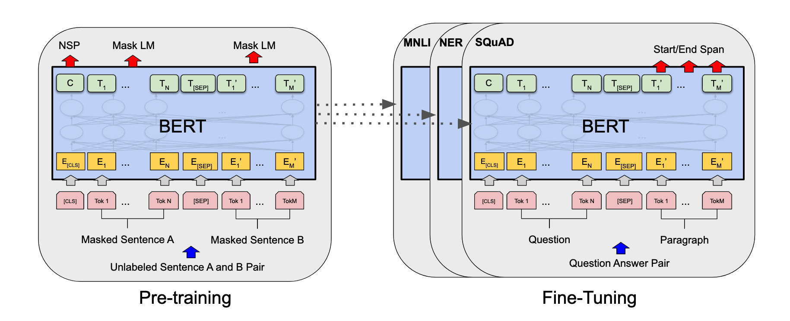
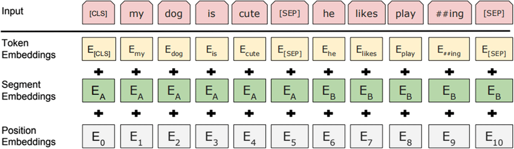

# **DLA-sentiment-analysis-wikipedia-comments**

> Questo è un progetto svolto nell'ambito dell'esame **Deep Learning and Applications Mod.2** del **CdLM in Informatica** presso l'**Università degli Studi di Cagliari**.

| **Studente**          | **Matricola** | **E-Mail**                        |
|-----------------------|---------------|-----------------------------------|
| Alessandra Perniciano | 60/73/65231   | <a.perniciano3@studenti.unica.it> |
| Federico Meloni       | 60/73/65243   | <f.meloni62@studenti.unica.it>    |

Questo progetto universitario si pone l'obiettivo di creare un modello con l'ausilio dei transformers in grado di classificare la tossicità dei commenti su [Wikipedia](https://www.wikipedia.org/).

Per raggiungere l'obiettivo sono stati utilizzati Python e tool come PyTorch e BERT.

Il dataset di partenza è stato preso da una [challenge](https://www.kaggle.com/competitions/jigsaw-toxic-comment-classification-challenge/) pubblicata su [Kaggle](https://www.kaggle.com/) nel 2018 da [Jigsaw](https://jigsaw.google.com/)

<br><br>

---
<br>

## **📊 Dominio ed analisi dei dati**

[Wikipedia](https://www.wikipedia.org/) oltre ad essere "*l'enciclopedia universale online*" integra al suo interno una struttura stile social-network in cui la community del sito può interagire e curare le pagine del sito.

Come ogni altra piattaforma sul web, al suo interno ci sono persone che interagiscono tra di loro in maniera civile ed incivile, il dataset utilizzato mette a disposizione 159.571 e 153.164 commenti della piattaforma rispettivamente per train e test set.

Ogni commento può avere zero o più tra le seguenti label apportate da moderatori umani:
- toxic
- severe_toxic
- obscene
- threat
- insult
- identity_hate

<br>

Come possiamo vedere dagli istogrammi qui sotto siamo davanti ad un dataset altamente sbilanciato (in quanto la maggior parte degli utenti su internet non è tossica):


<p align="center">
    
</p>

<br>

Di seguito le parole più comuni nell'intero dataset e quelle più comuni per ogni etichettà

<p align="center">
    
    
</p>

<br><br>

---
<br>

## **🧮 Preprocessing**

Per poter operare dei dati bisogna prima effettuare delle operazioni di preprocessing.  
Il nostro preprocessing consiste nel manipolare il dataset in modo da eliminare le informazioni inutili o peggio fuorvianti per la rete, oltre all'eliminazione dei dati quel che abbiamo fatto è andare ad aggiungere informazioni (es. POS Tag) e a semplificare le varie frasi (con la lemmatizazione).

<br>

### **✂️ Subsampling del dataset**

Il dataset risulta essere molto sbilanciato, per questo motivo è stato optato per un subsampling della classe dominante, che risulta essere quella con tutte le classi poste a zero.  
Si è scelto di utilizzare la proporzione 50/50, dove metà del dataset risultano essere commenti "puliti", mentre l'altra metà dei record ha un qualche grado di tossicità.

Il dataset è sceso a 32450 record, di cui:
- 16225 sono non tossici
- 15294 presentano almeno la label "toxic"
- 1595 presentano almeno la label "severe_toxic"
- 8449 presentano almeno la label "obscene"
- 478 presentano almeno la label "threat"
- 7877 presentano almeno la label "identity_hate"

<br>

### **🧹 Pulizia dei dati**

La pulizia dei dati si è divisa in vari sottopassaggi.  
Avendo come dominio il linguaggio naturale dobbiamo tenere conto di tutte le possibili variazioni che possono creare del rumore all'interno del dataset.

Come prima cosa abbiamo portato tutto il dataset in **caratteri minuscoli**, in quanto le lettere maiuscole sono caratteri diversi che veicolano le stesse informazioni di quelli minuscoli.

Dopo di che abbiamo fatto un primo passaggio di standardizzazione del linguaggio **eliminando tutte le contrazioni** presenti in lingua inglese e ponendole in forma estesa (es. "*you're*" -> "*you are*").

Insieme all'eliminazione delle contrazioni abbiamo fatto la **pulizia dello slang** solito dell'internet, andando a sostituire tutte quelle sigle, forme contratte ed abbreviazioni con la loro controparte "canonica" (es. "*m8*" -> "*mate*").

Dopo di che si è passati all'**eliminazione di tutti i caratteri speciali**, in particolare parliamo di simboli, link, tag HTML, caratteri non ASCII.  
Si è deciso quindi di eliminare anche la punteggiatura.

Infine è giunto il momento di **togliere le stopwords**, cioé tutte quelle parole di circostanza che aiutano nella forma ma non veicolano nessuna informazione utile (es. "*the*", "*and*" etc.)

Una volta fatto ciò sono stati **eliminati quegli ultimi tag rimasti** (```\r``` e ```\n```), **i caratteri di spazio ridondanti e quelli ad inizio e fine riga**.

Questa pulizia è stata eseguita sia sul train set e sia sul test set.  
Qui alcuni esempi del prima e del dopo la pulizia:
| **Testo originale**                               	| **Testo pulito**                                  	|
|---------------------------------------------------	|---------------------------------------------------	|
| Explanation\r\nWhy the edits made under my use... 	| explanation why edits made username hardcore m... 	|
| COCKSUCKER BEFORE YOU PISS AROUND ON MY WORK      	| cocksucker piss around work                       	|
| I don't anonymously edit articles at all.         	| anonymously edit articles                         	|
| D'aww! He matches this background colour I'm s... 	| daww matches background colour seemingly stuck... 	|
| Please do not add nonsense to Wikipedia. Such ... 	| please add nonsense wikipedia edits considered... 	|

<br>

### **📑 Part of Speech Tagging & Lemmatizazione**
Successivamente alla pulizia del testo si può procedere al **Part of Speech Tagging**, cioè quell'operazione che associa ad ogni parola un tag tra i seguenti:
- N: noun (nome)
- V: verb (verbo)
- J: adj (aggettivo)
- R: adv (avverbio)

Questo permette all'operazione successiva, la **lemmatizzazione**, di avvenire in maniera migliore.

La lemmatizzazione è quell'operazione che porta tutti i sostantivi alla forma base, per esempio i verbi vengono tutti portati all'infinito e gli aggettivi vengono portati tutti alla forma base, andando a modificare eventuali superlativi etc.  
Abbiamo scelto di effettuare la lemmatizzazione anziché solo uno stemming in quanto abbiamo valutato che, per i nostri scopi, informazioni come il tempo verbale non fossero rilevanti, al contratio l'utilizzo di più parole per veicolare lo stesso messaggio avrebbe solo aggiunto rumore al nostro dataset.

Alcuni esempi:
| **Testo originale**                               | **Testo pulito**                                  | **POS Tag**                                       | **Lem**                                           |
|---------------------------------------------------|---------------------------------------------------|---------------------------------------------------|---------------------------------------------------|
| Hey man, I'm really not trying to edit war. It... | hey man really trying edit war guy constantly ... | [(hey, n), (man, n), (really, r), (trying, v),... | hey man really try edit war guy constantly rem... |
| Yes, because the mother of the child in the ca... | yes mother child case michael jackson studied ... | [(yes, n), (mother, n), (child, n), (case, n)...  | yes mother child case michael jackson study mo... |
| Before you start throwing accusations and warn... | start throwing accusations warnings let us rev... | [(start, v), (throwing, v), (accusations, n), ... | start throw accusation warning let u review ed... |
| The Mitsurgi point made no sense - why not ar...  | mitsurugi point made sense argue include hindi... | [(mitsurugi, n), (point, n), (made, v), (sense... | mitsurgi point make sense argue include hindi...  |
| Don't mean to bother you \r\n\r\ni see that yo... | mean bother i see writing something regarding ... | [(mean, v), (bother, n), (i, n), (see, v), (wr... | mean bother i see write something regarding re... |

<br>


---

<br>

## **🧪 Creazione del modello e Fine Tuning**
Il modello scelto è stato **BERT (Bidirectional Encoder Representation from Transformers)** a cui è stato sottoposto un fine tuning.  
BERT è un modello basato sui transformer utilizzato nell'elaborazione del linguaggio naturale presentato da Google nel 2018 e che dal 2019 è stato integrato nel suo motore di ricerca.

I modelli originali sono stati addestrati su BookCorpus e su Wikipedia in lingua inglese, per un totale di circa 3200 milioni di parole. Il BERT originale consisteva in due modelli:
- BERT<sub>BASE</sub>: 12 encoder, ciascuno dei quali prevede *12 bidirectional self-attention heads*
- BERT<sub>LARGE</sub>: 24 encoder, ciascuno dei quali prevede *16 bidirectional self-attention heads*

<p align="center">
    
</p>

Il modello specifico che abbiamo selezionato per il nostro progetto è "*BERT<sub>BASE</sub> - uncased*".  
Questo modello ha le stesse caratteristiche di BERT<sub>BASE</sub> ma è stato addestrato su un vocabolario totalmente in minuscolo, quindi risulta non essere case-sensitive.  
BERT<sub>BASE</sub> - uncased ha 12 livelli di encoder, 768 hidden layers, 12 attention heads e 110 milioni di parametri.

>In presenza di GPU Nvidia la nostra implementazione è compatibile con le accellerazioni CUDA.

<br>

### **🎟️ Preprocessing per BERT**
Il preprocessing specifico per BERT prevede l'aggiunta di un token speciale all'inizio e alla fine di ogni frase, dopodiché si fa il padding/troncamento di ogni frase per avere una singola lunghezza costante di token. I token reali poi vengono differenziati dai token di padding attraverso una *attention mask*.

I parametri che si possono cambiare sono i seguenti (insieme ai valori impostati da noi):
- add_special_token = True
- max_length = 300
- pad_to_max_length = True
- truncation = True
- return_attention_mask = True

<p align="center">
    
</p>

<br>

### **🏋🏻 Inizializzazione del modello e training**
L'ottimizzatore scelto è AdamW, una versione dell'ottimizzatore Adam. Nello specifico Adam (ADaptive Moment Estimation) combina l'idea del momentum con quella del Root Mean Squared Prop (RMSProp) e dunque permette di avere il momentum nelle direzioni dove il gradiente è sempre lo stesso e di smorzarlo quando fluttua in presenza di varianza. In generale ci si sta spostando verso versioni di Adam, come AdamW, in quanto riducono il rischio di overfitting.
Ad AdamW sono stati passati gli iperparametri di BERT e sono stati impostati un *learning rate* pari a *1<sup>-4<sup>* e un *epsilon* pari a *1<sup>-8<sup>*.

Il training è stato fatto su 5 epoche, con una batch size di 16 e *BCE with Logits* come funzione loss. 

>Gli autori di BERT suggeriscono di utilizzare un batch size di 16 o 32, ma in questo caso abbiamo scelto 16 per evitare di esaurire la memoria GPU.

<br>

Di seguito i risultati:
| Epoch  |  Batch  |  Train Loss  |  Val Loss  |  Val Acc  |  Elapsed |
|--------|---------|--------------|------------|-----------|----------|
|   1    |    -    |   0.171176   |  0.056176  |   0.98    |  923.54  |
|   2    |    -    |   0.123939   |  0.050089  |   0.98    |  924.27  |
|   3    |    -    |   0.102258   |  0.050089  |   0.98    |  914.36  |
|   4    |    -    |   0.102119   |  0.050089  |   0.98    |  924.47  |
|   5    |    -    |   0.102489   |  0.050089  |   0.98    |  914.96  |


<br>

---

<br>

## **🔍 Risultati**
Dopo aver concluso l'addestramento del modello siamo passati alla sua valutazione con l'ausilio del test set, producendo i seguenti risultati:
- Accuracy: 0.9563951504077207
- Hamming score: 0.8307334246963753

L'**accuratezza** è una metrica comune per valutare la performance di un modello di classificazione. Si calcola come il numero di predizioni corrette su totale di predizioni fatte. In una classificazione multilabel, l'accuratezza è il rapporto tra il numero di etichette predette correttamente e il numero totale di etichette predette.  
Nel nostro caso, l'accuratezza è alta ma bisogna considerare che il test set è sbilanciato in quanto non è stato modificato per poter confrontare i risultati con quelli ottenuti dagli altri partecipanti della challenge.

L'**hamming score**, invece, si concentra sul numero di etichette predette correttamente su un numero totale di etichette possibili, quindi risulta una metrica attendibile nelle classificazioni multi-label.
In altre parole, l'hamming score misura il grado di somiglianza tra le etichette predette e quelle effettive, un punteggio più alto indica che le etichette predette sono più simili a quelle effettive.  
L'hamming score calcolato sui nostri risultati è soddisfacente e ci permette di dire che il modello è in grado di predire correttamente un numero elevato di etichette.
