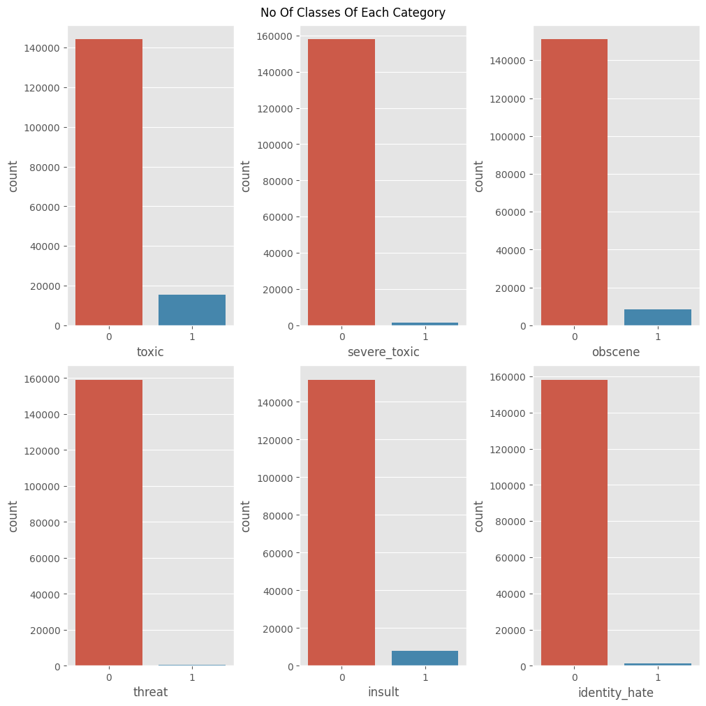
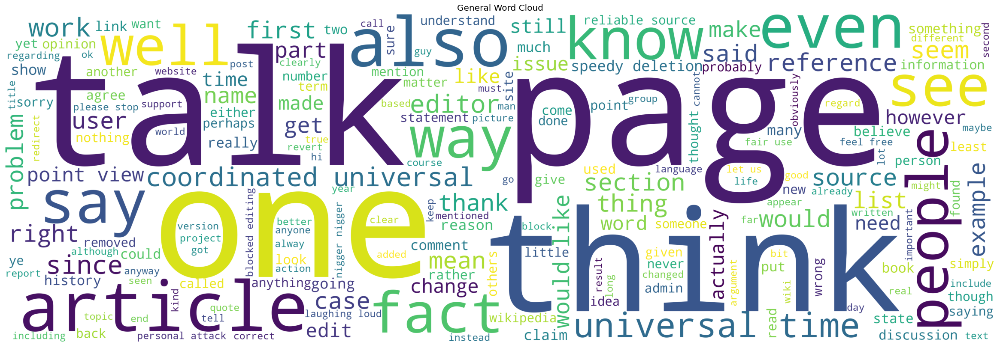
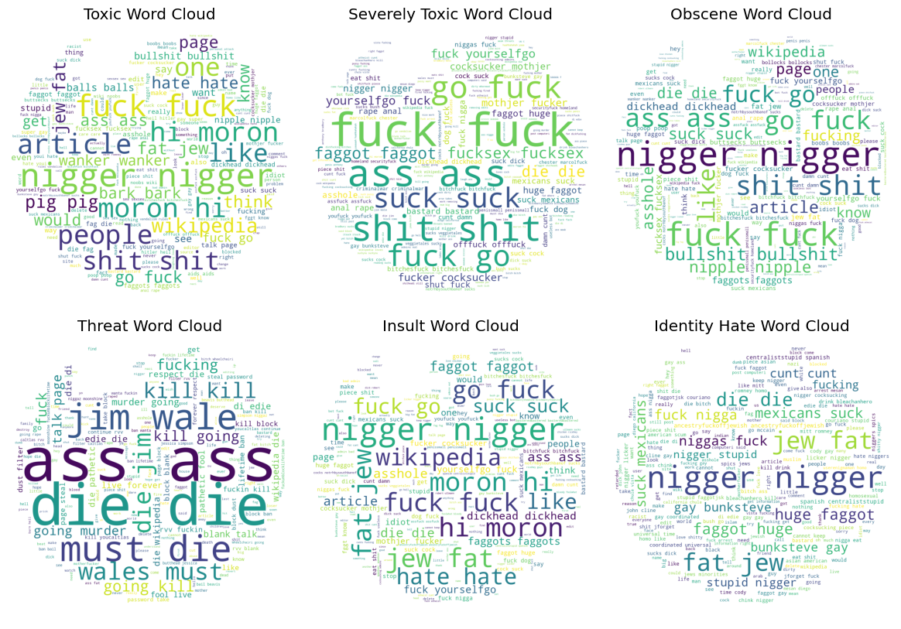

# **DLA-sentiment-analysis-wikipedia-comments**

> Questo è un progetto svolto nell'ambito dell'esame **Deep Learning and Applications Mod.2** del **CdLM in Informatica** presso l'**Università degli Studi di Cagliari**.

| **Studente**          | **Matricola** | **E-Mail**                        |
|-----------------------|---------------|-----------------------------------|
| Alessandra Perniciano | 60/73/xxxxx   | <a.perniciano3@studenti.unica.it> |
| Federico Meloni       | 60/73/xxxxx   | <f.meloni62@studenti.unica.it>    |

Questo progetto universitario si pone l'obiettivo di creare un modello con l'ausilio dei transformers in grado di classificare la tossicità dei commenti su [Wikipedia](https://www.wikipedia.org/).

Per raggiungere l'obiettivo sono stati utilizzati Python e vari framework come PyTorch e BERT.

Il dataset di partenza è stato preso da una [challange](https://www.kaggle.com/competitions/jigsaw-toxic-comment-classification-challenge/) pubblicata su [Kaggle](https://www.kaggle.com/) nel 2018 da [Jigsaw](https://jigsaw.google.com/)

  

---
 

## **Dominio ed analisi dei dati**

[Wikipedia](https://www.wikipedia.org/) oltre ad essere "*l'enciclopedia universale online*" integra al suo interno una struttura stile social-network in cui la community del sito può interagire e curare le pagine del sito.

Come ogni altra piattaforma sul web, al suo interno ci sono persone che interagiscono tra di loro in maniera civile ed incivile, il dataset utilizzato mette a disposizione 159.571 e 153.164 commenti della piattaforma rispettivamente per train e test set.

Ogni commento può avere zero o più tra le seguenti label apportate da moderatori umani:
- toxic
- severe_toxic
- obscene
- threat
- insult
- identity_hate

 

Come possiamo vedere dagli istogrammi qui sotto siamo davanti ad un dataset altamente sbilanciato (in quanto la maggior parte degli utenti su internet non è tossica):

 

Di seguito le parole più comuni nel dataset  

Mentre se prendiamo in considerazione solo i record etichettati come tossici  

  

---
 

## **Preprocessing**

### Pulizia dei dati

### Part of Speech Tagging & Lemmatizazione

### Text Feature Extraction

### TD-IDF

---
## **Creazione del modello e Fine Tuning**
